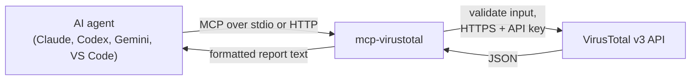

<p align="center">
  <picture>
    <source media="(prefers-color-scheme: dark)" srcset="docs/assets/banner-dark.svg">
    
  </picture>
</p>

<p align="center">
  <a href="https://www.npmjs.com/package/@burtthecoder/mcp-virustotal"></a>
  <a href="https://github.com/w0h1v/mcp-virustotal/actions/workflows/ci.yml"></a>
  <a href="LICENSE"></a>
  
  <a href="https://registry.modelcontextprotocol.io"></a>
  <a href="https://smithery.ai/server/@burtthecoder/mcp-virustotal"></a>
</p>

<p align="center">
  <a href="#quickstart">Quickstart</a> ·
  <a href="#tools">Tools</a> ·
  <a href="#http-streaming-transport">HTTP</a> ·
  <a href="#security">Security</a> ·
  <a href="#troubleshooting">Troubleshooting</a> ·
  <a href="https://w0h1v.github.io/mcp-virustotal/">Docs</a>
</p>

**mcp-virustotal** is an [MCP](https://modelcontextprotocol.io) server that gives AI agents access to the [VirusTotal v3 API](https://docs.virustotal.com/reference/overview). Hand your agent a hash, URL, IP or domain and get back the detection report plus the relationships an analyst would pivot on: contacted hosts, dropped files, resolutions, threat actors.

> [!NOTE]
> Independent project, not affiliated with VirusTotal or Google. You need your own [VirusTotal API key](https://www.virustotal.com/gui/my-apikey).

## Highlights

- **Reports with relationships.** File, URL, IP and domain reports fetch key relationships in one batched `?relationships=` call to save quota.
- **Cache first.** `get_url_report` returns the cached VirusTotal report and only submits a scan on a cache miss.
- **Pivot tools.** Corpus search with VTI-style modifiers (`type:peexe positives:5+`), merged sandbox behaviour summaries, and threat-actor and malware-family collections.
- **Full relationship paging.** 100+ relationship types across files, URLs, IPs and domains, with cursor pagination.
- **Two transports.** stdio for desktop clients, HTTP streaming for a shared service.
- **Tested.** Unit tests for the formatters and API layer run in CI on Node 20, 22 and 24.

## How it works



## Quickstart

**Requirements:** Node.js 20 or newer and a VirusTotal API key.

```sh
# Claude Code
claude mcp add --transport stdio --env VIRUSTOTAL_API_KEY=your-key virustotal -- npx -y @burtthecoder/mcp-virustotal

# Codex CLI
codex mcp add virustotal --env VIRUSTOTAL_API_KEY=your-key -- npx -y @burtthecoder/mcp-virustotal

# Gemini CLI
gemini mcp add -e VIRUSTOTAL_API_KEY=your-key virustotal npx -y @burtthecoder/mcp-virustotal
```

For Claude Desktop, VS Code, Smithery and running from source, see [Connect a client](docs/clients.md).

Then ask your agent: *"Look up the SHA-256 `275a021bbfb6489e54d471899f7db9d1663fc695ec2fe2a2c4538aabf651fd0f` (the EICAR test file) and show what it drops and contacts."*

## Tools

Eleven tools. Full parameters and relationship lists are in the [tool reference](docs/tools.md).

| Group | Tools |
|---|---|
| Reports (with relationships) | `get_file_report`, `get_url_report`, `get_ip_report`, `get_domain_report` |
| Relationship paging | `get_file_relationship`, `get_url_relationship`, `get_ip_relationship`, `get_domain_relationship` |
| Search and pivot | `search_vt`, `get_file_behaviour_summary`, `get_collection` |

## HTTP streaming transport

stdio is the default. Set `MCP_TRANSPORT=httpStream` to run a standalone HTTP service:

```sh
MCP_TRANSPORT=httpStream MCP_PORT=3000 VIRUSTOTAL_API_KEY=your-key node build/index.js
```

```sh
docker build -t mcp-virustotal .
docker run -p 3000:3000 -e VIRUSTOTAL_API_KEY=your-key -e MCP_TRANSPORT=httpStream mcp-virustotal
```

A health check is served at `/health`.

### Environment variables

| Variable | Default | Description |
|---|---|---|
| `VIRUSTOTAL_API_KEY` | *(required)* | Your VirusTotal API key |
| `MCP_TRANSPORT` | `stdio` | `stdio` or `httpStream` |
| `MCP_PORT` | `3000` | HTTP port (`httpStream` only) |
| `MCP_ENDPOINT` | `/mcp` | HTTP endpoint path (`httpStream` only) |

## Security

> [!WARNING]
> The HTTP transport has **no authentication**. Keep the port on localhost or behind an authenticating reverse proxy, or anyone who can reach it can spend your API quota.

- Tool arguments are validated with zod schemas before any request is built.
- The API key is read from the environment and sent only to VirusTotal.
- Lookups send your indicators to VirusTotal. A URL scan on a cache miss submits that URL for analysis.

Report vulnerabilities privately; see [SECURITY.md](SECURITY.md).

## Troubleshooting

- **Wrong API key:** the key is usually 64 characters with no spaces or quotes. Restart the client after changing config.
- **429 errors:** the public tier allows 4 requests per minute.
- **Logs:** `logs/mcp-virustotal-server.log` in the package directory.

More in the [troubleshooting guide](docs/troubleshooting.md).

## Development

```sh
git clone https://github.com/w0h1v/mcp-virustotal && cd mcp-virustotal
npm ci
npm test                                  # build + unit tests, no key or network
VIRUSTOTAL_API_KEY=your-key npm run smoke # all 11 tools against the real API
```

The smoke test paces calls at 20 s for the public-tier limit and isn't suited to free tiers reduced to a few lookups a day. See [CONTRIBUTING.md](CONTRIBUTING.md) and the [changelog](CHANGELOG.md).

## License

MIT. See [LICENSE](LICENSE).
